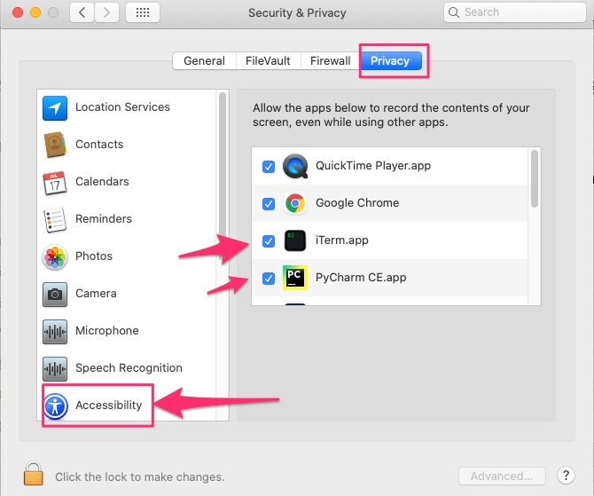

A toy program which screenshot's youtube.com and clicks on the  "Skip Ad" button.

This repo has a few copies of the "skip ad" button and uses `opencv`'s `matchTemplate` to find it. `matchTemplate` works fine since there is no depth, shadow, recording angle, change in skew, lighting effect etc. (In other words yes a deep neural net could be better but `matchTemplate` works just fine)

`mss` is used to take screenshots at high speed and `pyautogui` is used to move the cursor and click on the skip ad button.

Note:

1. this is a toy app for fun and education purposes
2. when the button is found, the mouse is literally moved to it, then it clicks twice and then the mouse is moved back, and then it clicks once
3. It is assumed that youtube is playing on a secondary monitor whose resolution is (1536,960) and is placed to the left of the primary monitor. 
4. A debug window opens by default showing what the program is reading
5. On a Mac "accessibility" access must be given to iterm or your IDE from where this program is run. Without this access it won't be able to control your mouse. 

To run:
```
conda env create -f environment.yml
pip install -r requirements.txt
python click_on_skip_ad.py
```





